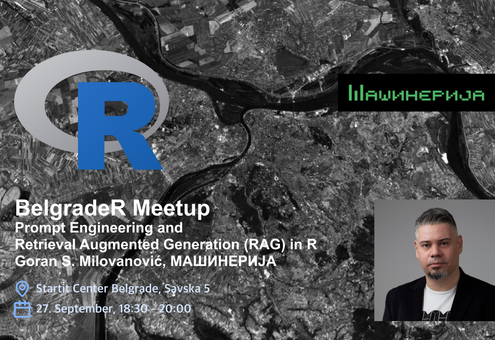
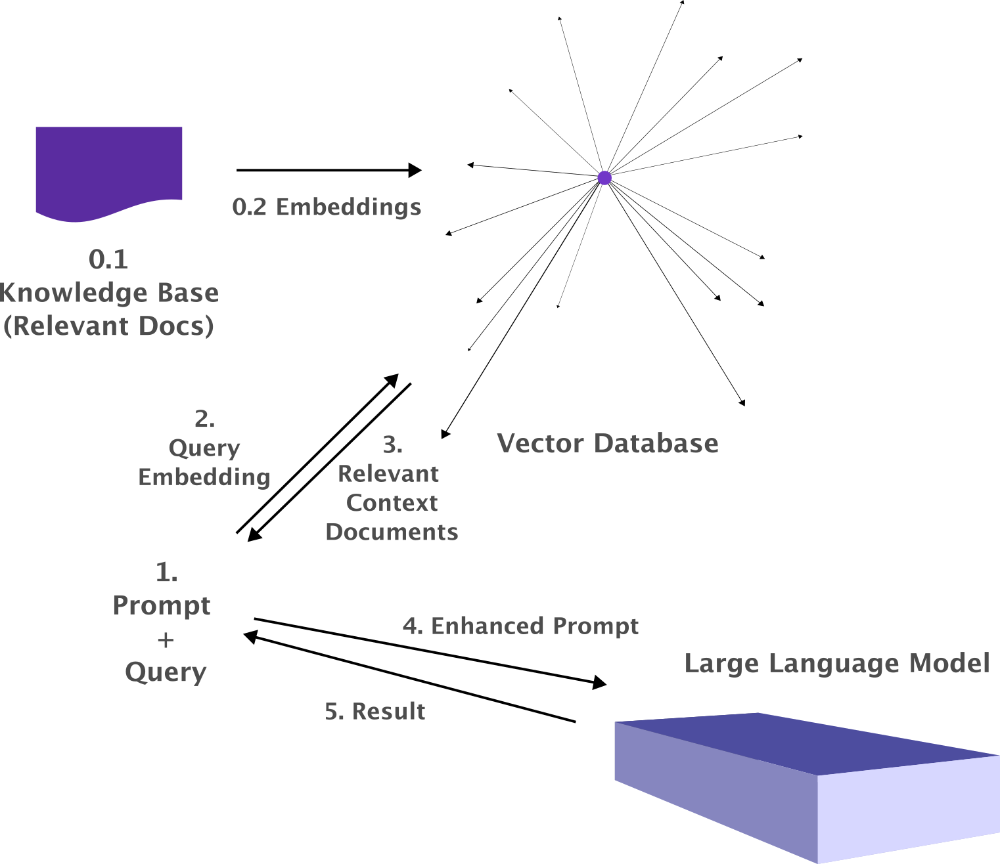

# belgrader03_rag repo

## BelgradeR meet-up New Series 03 :: Prompt Engineering and Retrieval Augmented Generation (RAG) from R.

Details

In the present-day world of burgeoning AI applications, Large Language Models (LLMs) have emerged as key 
instruments in numerous domains. For data enthusiasts and scientists who are well-versed in the R 
programming language, the ability to tap into these models and manipulate them for specific applications 
is an invaluable skill. This talk will be an illuminating dive into interfacing with OpenAI's GPT models 
including ChatGPT, through the R language, and expanding upon how to craft and structure prompts 
effectively. Here is what I will cover in the talk:

- An Overview of Packages for LLMs in R: We will begin by introducing the landscape of R packages that 
facilitate interactions with LLMs. Our main focus will be on those that allow seamless interaction with 
the OpenAI API.

- Prompt Engineering Using Functional Programming: The art of prompt crafting can often dictate the 
success of a generative model's response. Building on R's strong foundation in functional programming, I will 
delve into the principles and practices of constructing effective prompts that can harness the true 
potential of LLMs.

- Retrieval Augmented Generation (RAG) in R with PostgreSQL: To culminate, we'll introduce the RAG 
framework, which augments the power of generative models with retrieval capabilities. By integrating with 
PostgreSQL equipped with the [pgvector](https://github.com/pgvector/pgvector) extension, participants 
will learn how to set up an AI-powered service in R that leans on vector database capabilities, paving the way for more efficient and relevant 
generative outputs.

